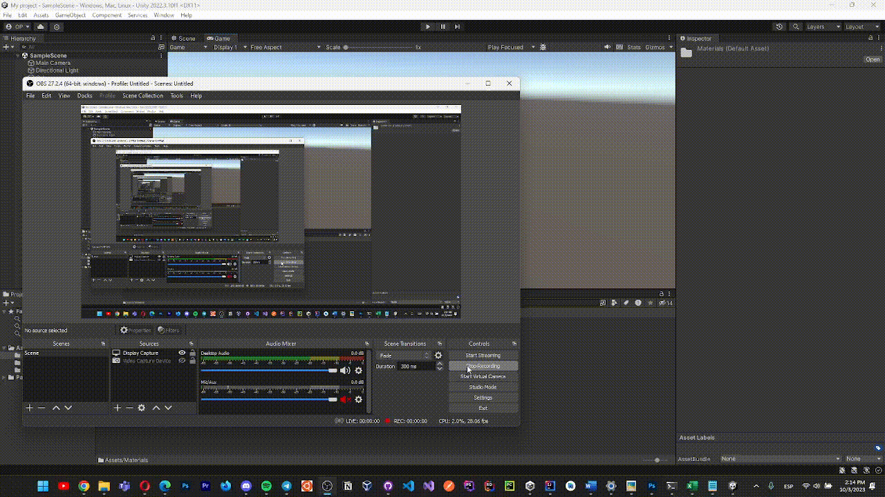

ENGLISH BELOW\/\/\/\/
## Descripción

Este informe describe el desarrollo y la funcionalidad de un proyecto Unity que implica la manipulación de objetos de juego en una escena 3D. El proyecto consiste en múltiples tareas que requirieron la creación de scripts para lograr objetivos específicos. Las tareas incluyen:

Movimiento aleatorio del cubo:

Un script asociado al cubo que inicializa un array de valores numéricos aleatorios.
En cada fotograma, se aplica un cambio de posición aleatorio, y los valores superiores a 15 se muestran en la consola.
El rango de valores aleatorios puede parametrizarse en el Inspector.
Asignar materiales a objetos:

Se crearon materiales con diferentes colores y se asignaron a los renderizadores de los objetos del juego en el Inspector de Unity.
Operaciones vectoriales de la esfera:

Un script para la esfera que calcula y muestra en la consola:
La magnitud de dos variables Vector3.
El ángulo entre estos vectores.
La distancia entre ellos.
Un mensaje indicando qué vector está a mayor altura.
Todos los valores se muestran en el Inspector.
Alinear Cubo y Cilindro con Esfera:

Un script para alinear el cubo y el cilindro con la esfera, 5 unidades a derecha e izquierda en el eje X.
La coordenada X de la posición de la esfera puede cambiarse en el Inspector.
Cambiar color al pulsar una tecla:

Un script que cambia el color de un objeto cuando se pulsa una tecla específica.
El cambio de color se activa pulsando la tecla de flecha "Arriba".
El color y la tecla pueden configurarse en el Inspector.
Esferas adicionales e interacciones:

Se añaden esferas adicionales a la escena, agrupadas por etiquetas.
El script calcula las distancias del segundo grupo de esferas al cubo.
Aumenta la altura de la esfera más cercana y cambia el color de la más lejana cuando se pulsa la tecla espacio.
Implementación:

El proyecto fue implementado en Unity usando scripts en C#. Cada tarea se abordó creando y adjuntando los scripts pertinentes a los objetos de juego apropiados. Se utilizaron variables públicas para permitir la personalización de los parámetros en el Inspector de Unity.
## Ejecución

## Resultados

El proyecto logró con éxito lo siguiente:

El cubo mostraba valores numéricos aleatorios y actualizaba sus posiciones.
Se asignaron materiales a los objetos, creando colores distintos para cada uno.
La esfera realizaba operaciones vectoriales y mostraba información relevante.
El cubo y el cilindro se alinearon con la esfera en función de los desplazamientos del eje X.
Los objetos cambian de color al pulsar las teclas especificadas.
Se añadieron esferas adicionales y se interactuó con ellas como se describe en la tarea.
Conclusiones:

El proyecto Unity demostró conceptos fundamentales de desarrollo de juegos, incluyendo manipulación de objetos, operaciones vectoriales, asignación de materiales y manejo de entradas de usuario. Las tareas mostraron cómo utilizar scripts C# para controlar y personalizar el comportamiento de los objetos en un entorno 3D.

English:
## Introduction

This report outlines the development and functionality of a Unity project involving the manipulation of game objects in a 3D scene. The project consists of multiple tasks that required the creation of scripts to achieve specific goals. The tasks include:

Cube Random Movement:

A script associated with the cube that initializes an array of random numeric values.
In each frame, a random position change is applied, and values greater than 15 are displayed in the console.
The range for random values can be parameterized in the Inspector.
Assign Materials to Objects:

Materials were created with different colors and assigned to game objects' renderers in the Unity Inspector.
Sphere Vector Operations:

A script for the sphere that calculates and displays in the console:
The magnitude of two Vector3 variables.
The angle between these vectors.
The distance between them.
A message indicating which vector is at a greater height.
All values are displayed in the Inspector.
Align Cube and Cylinder with Sphere:

A script to align the cube and cylinder with the sphere, 5 units to the right and left on the X-axis.
The X-coordinate of the sphere's position can be changed in the Inspector.
Change Color on Key Press:

A script that changes the color of an object when a specific key is pressed.
The color change is triggered using the "Up" arrow key.
The color and key can be configured in the Inspector.
Additional Spheres and Interactions:

Additional spheres are added to the scene, grouped by tags.
The script calculates the distances of the second group of spheres to the cube.
It increases the height of the nearest sphere and changes the color of the farthest one when the space key is pressed.
Implementation:

The project was implemented in Unity using C# scripts. Each task was addressed by creating and attaching the relevant scripts to the appropriate game objects. Public variables were used to allow customization of parameters in the Unity Inspector.
## Execution

## Results

The project successfully accomplished the following:

The cube displayed random numeric values and updated their positions.
Materials were assigned to objects, creating distinct colors for each.
The sphere performed vector operations and displayed relevant information.
The cube and cylinder aligned with the sphere based on X-axis offsets.
Objects changed colors on key presses as specified.
Additional spheres were added and interacted with as described in the task.
## Conclusion

The Unity project demonstrated fundamental game development concepts, including object manipulation, vector operations, material assignments, and user input handling. The tasks showcased how to use C# scripts to control and customize the behavior of objects in a 3D environment.