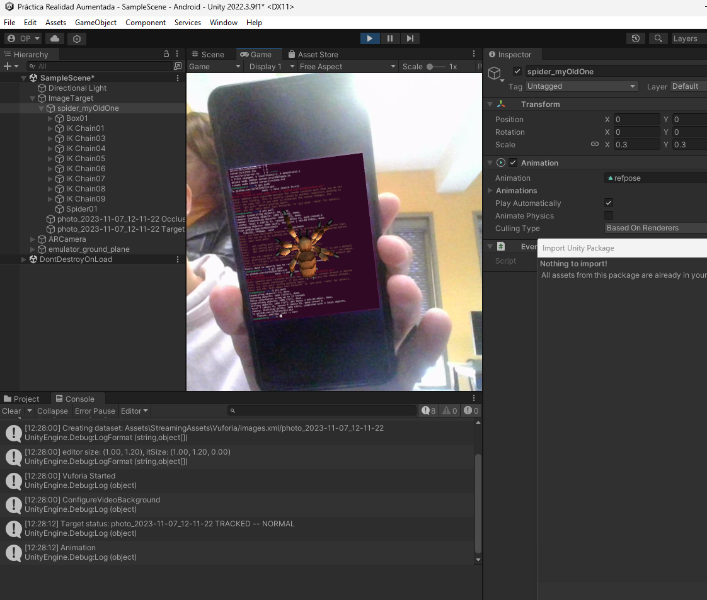

# Práctica 6 - Práctica Realidad Aumentada

Crea una escena de realidad aumentada que reconozca una imagen y muestre una araña sobre ella. Crea un evento que gire al zombi cuando aparezca.

## Ejercicio

# Exercise 6 - Augmented reality exercise

Create an augmented reality scene that recognizes an image and shows a spider on top of it. Created an event that rotates the zombie when it appears.

## Exercise

