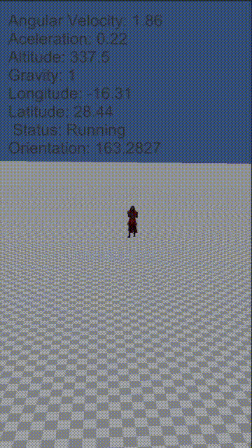

# Sensores
El objetivo de esta práctica es hacer que el samurái apunte siempre al norte con su espada, y que el programa muestre la información obtenida de los sensores.

A continuación se muestra una imagen gif que muestra cómo realizar el primer y segundo ejercicio

## Ejercicio

