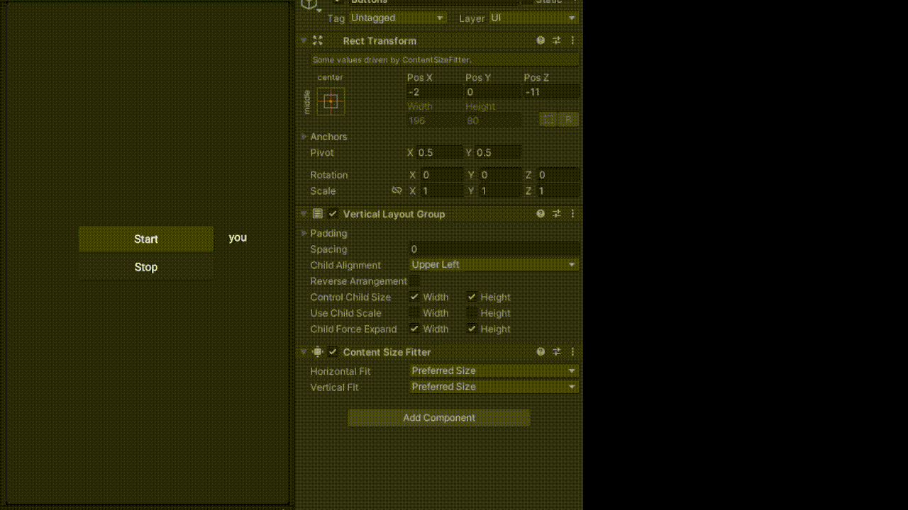

# Reconocimiento del habla
El objetivo de esta práctica es aprender a utilizar el reconocimiento de voz en una unidad y realizar una escena en la que la araña siga órdenes de voz

A continuación encontrará imágenes gif que muestran cómo se realizan los ejercicios.

## Ejercicio 1

# Voice Recognition
The purpose of this practice is to learn how to use voice recognition in a unit and make a scene where the spider will execute voice commands.

Below are gif images that show how the exercises are performed.

## Exercise 1

