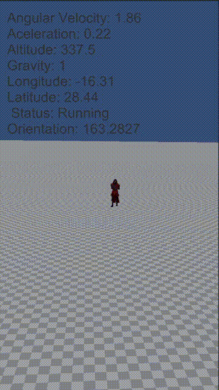

# Sensores
El objetivo de esta práctica es hacer que el samurái apunte siempre al norte con su espada, y que el programa muestre la información obtenida de los sensores.

A continuación se muestra una imagen gif que muestra cómo realizar el primer y segundo ejercicio

## Ejercicio

# Sensors
The objective of this practice is to make the samurai always point north with his sword, and the program displays the information obtained from the sensors.

Below is a gif image showing how the first and second exercises are performed.

## Exercise

